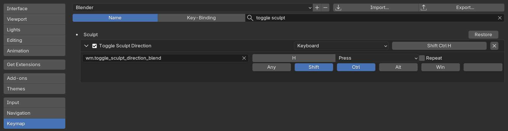

# Expanded Brush Utilities
This is a re-write of [Jeff Boller's Toggle And Subtract Brush Blend](https://blenderartists.org/t/weight-painting-toggle-between-add-and-subtract/1161121/13) addon.

This addon adds a hotkey for toggling brush sculpting direction (sculpt mode only).

And adds hotkeys for toggling front facing only and falloff mode between sphere and projected for scultping, weightpainting, and texture painting.

### Keybindings
I've set the default keyinds as follows:
- Toggle Sculpt Direction: `Ctrl + Shift + H`
- Toggle Front Facing Only: `Ctrl + Shift + J`
- Toggle Falloff Shape: `Ctrl + Shift + K`

If you'd like to the bindings you can `Edit > Preferences > Keymap` and search for the name of the keybinding you'd like to change
